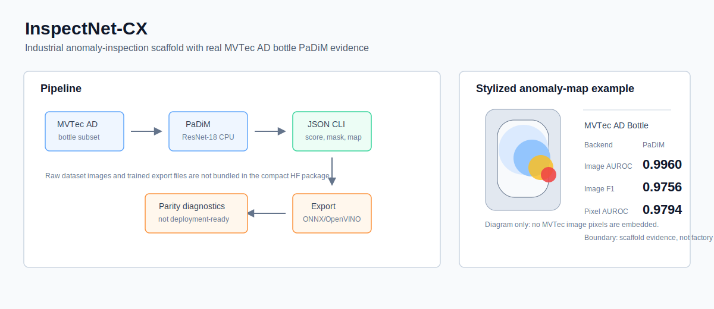

# InspectNet-CX



InspectNet-CX is a reproducible industrial anomaly-inspection harness on MVTec AD. It ships a
natively-trained reverse-distillation detector, two verified classical baselines (PaDiM and
PatchCore), a cross-category transfer study, and an ONNX/OpenVINO export-parity investigation
with a root-caused fix. The emphasis is reproducibility and honest, head-to-head evidence.

## Headline Results

**Native detector vs classical baselines, four MVTec AD categories** (image-level AUROC,
matched train/test):

| category | PaDiM (ResNet-18) | PatchCore | InspectNet-CX (reverse distillation, ours) |
| -------- | ----------------: | --------: | -----------------------------------------: |
| bottle   | 0.998 | 1.000 | 1.000 |
| cable    | 0.872 | 0.991 | 0.885 |
| capsule  | 0.881 | 0.994 | 0.901 |
| leather  | 0.993 | 1.000 | 1.000 |

`InspectNet-CX (reverse distillation)` is the repo's own from-scratch detector (a frozen
wide_resnet50_2 teacher; a bottleneck + decoder learn to reconstruct the teacher's multi-scale
features on normal images; reconstruction failure is the anomaly score). It is trained here, not
borrowed. Honest standing: it **ties PatchCore on `bottle` and `leather` (both 1.000)** and
**beats PaDiM on all four categories**, but it does **not** beat PatchCore overall, PatchCore
still leads on `cable` (0.991 vs 0.885) and `capsule` (0.994 vs 0.901). PaDiM/PatchCore are the
references, not the author's results. Numbers are read from
`reports/eval_harness/inspectnet_rd_*.json` (ours), `reports/cross_padim_matrix.json` (PaDiM
diagonal), and `reports/eval_harness/patchcore_*.json`.

The path here is documented in `docs/native_detector_ablations.md`: a vanilla student-teacher
trails badly (cable 0.751), a wider student-teacher backbone *collapses* to near-chance (its
capacity erases the anomaly residual), and reverse distillation, the frozen-teacher /
bottleneck / decoder paradigm, is what closed most of the gap. Fully matching PatchCore on
`cable`/`capsule` is open work (a faithful one-class bottleneck and longer training).

**PaDiM is category-specific.** Fitting a PaDiM memory bank on one category and scoring another
drops image AUROC by **0.431 (95% bootstrap CI [0.403, 0.458])**; the 12 off-diagonal cells
collapse to chance (~0.50). The full transfer matrix is in
`docs/padim_cross_category_transfer.md` and `reports/cross_padim_matrix.json`.

| train \ test | bottle | cable | capsule | leather |
| ------------ | -----: | ----: | ------: | ------: |
| **bottle**   | 0.998  | 0.500 | 0.458   | 0.563   |
| **cable**    | 0.540  | 0.872 | 0.500   | 0.489   |
| **capsule**  | 0.500  | 0.500 | 0.881   | 0.507   |
| **leather**  | 0.509  | 0.514 | 0.482   | 0.993   |

**ONNX/OpenVINO export-parity bug, root-caused and fixed.** The ONNX Runtime vs OpenVINO gap on
the exported PaDiM model was not preprocessing or dynamic shape: OpenVINO's CPU plugin defaults
`INFERENCE_PRECISION_HINT` to BF16 on AVX-512-BF16 hosts while ONNX Runtime stays FP32. Forcing
`--inference-precision f32` closes it: `pred_score` max-abs error drops from 7.9e-4 to 3.0e-8.
Full writeup in `docs/openvino_parity_resolution.md`.

A latency-benchmark harness with hardware fingerprinting (`/proc/cpuinfo`, `nvidia-smi`,
`/etc/nv_tegra_release`) is included; see `docs/latency_baseline.md`.

## Scope

This is a research and reproduction harness, not deployable inspection software. Concretely:

- The native reverse-distillation detector (`src/inspectnet_cx/models/reverse_distill.py`) is
  really trained here and ties PatchCore on two of four categories, but still trails it on
  `cable`/`capsule`; fully matching PatchCore is open work, not a solved claim. The earlier
  student-teacher (`student_teacher.py`) is kept for the ablation. The separate Hugging
  Face-style `InspectNetCX` class (`modeling_inspectnet_cx.py`) is a packaging/API scaffold.
- All evidence is on local MVTec AD; no VisA / MVTec AD 2 / LOCO, no Jetson or TensorRT
  measurement. The OpenVINO parity fix is verified on CPU only.
- Deployment would still require a trained checkpoint, held-out metrics on the target line,
  export parity on target hardware, latency budgets, monitoring, and an operator runbook.

## Setup

```bash
make setup                 # uses uv if available
# or
python3 -m venv .venv && . .venv/bin/activate && pip install -e ".[all]"
```

Verified on Ubuntu 22.04 / Linux 6.8, x86_64, Python 3.10.12. CUDA is optional; the published
MVTec evidence ran on CPU. Optional verified stack: Torch 2.11.0+cu128, Torchvision
0.26.0+cu128 (dependency provenance, not a CUDA or Jetson validation claim).

## Dataset

MVTec AD is **not** bundled (license: CC BY-NC-SA 4.0, non-commercial). Fetch it into a local
data root and point the scripts at it:

```bash
python3 scripts/download_mvtec.py --category bottle --data-root ~/datasets
```

The local `bottle` subset used for the verified evidence is ~151 MB (209 normal-train,
20 normal-test, 63 anomaly-test images). Provenance and checksum are recorded in
`reports/agent_b/dataset_provenance_mvtec_ad_bottle.json`.

## Reproduce

```bash
# Train + evaluate the native InspectNet-CX reverse-distillation detector (shipped)
PYTHONPATH=src python3 scripts/train_inspectnet_cx.py \
  --model reverse_distill --category bottle --dataset-root ~/datasets/mvtec_ad \
  --epochs 150 --batch-size 16 --lr 5e-3 --device cuda \
  --output reports/eval_harness/inspectnet_rd_bottle.json

# (ablation) the earlier student-teacher detector
PYTHONPATH=src python3 scripts/train_inspectnet_cx.py \
  --category bottle --dataset-root ~/datasets/mvtec_ad \
  --epochs 100 --device cuda --output reports/eval_harness/inspectnet_st_bottle.json

# PaDiM + PatchCore baseline on one category
PYTHONPATH=src python3 scripts/eval_harness.py \
  --methods padim patchcore --dataset mvtec_ad --category bottle \
  --dataset-root ~/datasets --output-dir reports/eval_harness

# Cross-category transfer matrix
PYTHONPATH=src python3 scripts/cross_category_padim.py --dataset-root ~/datasets
PYTHONPATH=src python3 scripts/build_cross_transfer_matrix.py

# ONNX/OpenVINO parity check (shows the BF16-vs-FP32 effect)
PYTHONPATH=src python3 scripts/validate_padim_export.py \
  --onnx <model.onnx> --openvino <model.xml> \
  --input ~/datasets/mvtec_ad/bottle/test/good/000.png \
  --inference-precision f32
```

## Validation

```bash
pytest -q                       # 80 tests
ruff check src tests scripts
python -m build
```

## Repository Layout

- `src/inspectnet_cx/` — package: model API scaffold, eval, calibration, latency, training.
- `scripts/` — baseline, eval-harness, export-parity, cross-category, and latency CLIs.
- `reports/` — tracked result JSONs (no dataset images are committed).
- `docs/` — the cross-category transfer study, OpenVINO parity resolution, claims ledger,
  benchmark protocol, and latency baseline.

## License

Code is licensed **Apache-2.0** (`LICENSE`). Any MVTec-derived artifact (scores, thresholds,
result JSONs computed from MVTec AD images) inherits MVTec AD's **CC BY-NC-SA 4.0
non-commercial** terms. No MVTec images are redistributed in this repository.

## Citation

See `CITATION.cff`.
